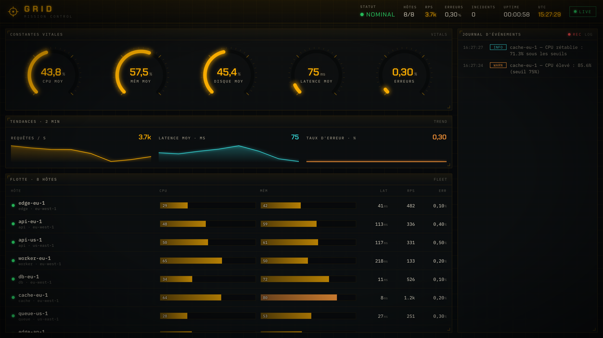
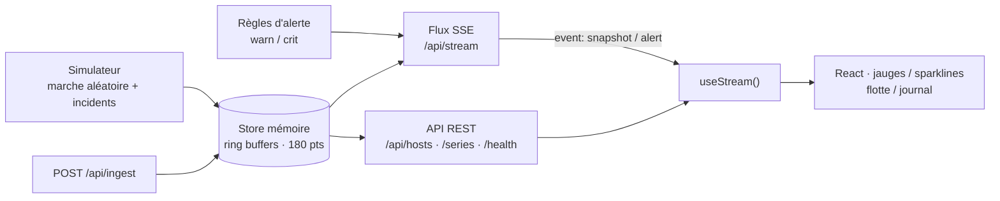

# GRID · Mission Control

> _Tableau de bord d'observabilité **temps réel** auto-hébergé, avec une identité visuelle « salle de contrôle / CRT phosphore » dessinée sur mesure._


GRID surveille une flotte de serveurs/services et restitue leurs métriques **en direct** : jauges en arc, sparklines, état de la flotte et journal d'événements qui défile. Le tout dans un thème « centre de contrôle » assumé — pensé pour **ne ressembler à aucun dashboard générique**.

C'est un projet **full-stack** : un backend Node (Fastify) qui simule la flotte, expose une API REST et un flux **Server-Sent Events**, et un front **React + TypeScript** qui consomme ce flux et dessine des instruments en SVG.

## 🖼️ Aperçu

GRID en fonctionnement — constantes vitales, tendances sur 2 min, flotte et journal d'événements live :



## 📋 Sommaire

- [Contexte & objectif](#-contexte--objectif)
- [Architecture](#-architecture)
- [Design system](#-design-system)
- [Stack technique](#-stack-technique)
- [Structure du dépôt](#-structure-du-dépôt)
- [Prérequis](#-prérequis)
- [Démarrage rapide](#-démarrage-rapide)
- [API](#-api)
- [Ce que ce projet démontre](#-ce-que-ce-projet-démontre)
- [Déploiement AWS](#-déploiement-aws)
- [Roadmap](#-roadmap)
- [Licence](#-licence)

## 🎯 Contexte & objectif

Les outils d'observabilité (Grafana & co.) sont puissants mais visuellement interchangeables. GRID part de l'idée inverse : **une interface à forte personnalité**, comme une console de mission, tout en restant un vrai produit temps réel et performant. L'objectif est de démontrer à la fois la **maîtrise front** (design system sur mesure, dataviz dessinée à la main, animations, temps réel) et la **maîtrise back** (API, flux événementiel, modèle de données en mémoire, règles d'alerte).

## 🏗️ Architecture



- **Un seul tick** (1 Hz) fait évoluer toute la flotte, met à jour le store et **diffuse** un `snapshot` à tous les clients SSE connectés (pas de timer par client).
- Les **incidents** (montée de CPU/latence/erreurs, palier, rétablissement) génèrent des **alertes** `warn`/`crit`/`info` poussées sur le même flux.
- Le front conserve une **fenêtre glissante** d'instantanés pour alimenter les sparklines, sans rappeler le serveur.

## 🎨 Design system

Identité **« salle de contrôle / CRT phosphore »**, exécutée avec précision :

| Élément | Choix |
|--------|-------|
| **Typographie** | `Chakra Petch` (display technique, anguleux) + `IBM Plex Mono` (données) — délibérément hors des polices génériques |
| **Couleur** | Noir profond légèrement chaud · **ambre phosphore** dominant (`#FFB000`) · vert « nominal » · rouge « critique » · cyan secondaire |
| **Atmosphère** | Scanlines CRT, grain animé, vignette, **glow** sur le texte, fond en **grille** (clin d'œil au nom) |
| **Instruments** | Jauges en **arc 270° dessinées en SVG** (graduations + glow), sparklines à dégradé, LED de statut clignotantes |
| **Motion** | **Séquence de boot** (les panneaux s'allument en cascade), flux d'événements qui se déroule, oscillation CRT subtile |

Tous les jetons sont des variables CSS (`web/src/styles/global.css`) ; chaque composant a son module CSS scopé.

## 🧱 Stack technique

| Couche | Technologies | Rôle |
|--------|--------------|------|
| Front | React 18, TypeScript, Vite 6 | UI temps réel, instruments SVG, design system |
| Temps réel | `EventSource` (SSE) | Réception des `snapshot`/`alert` sans polling |
| Back | Node 20, Fastify 5, `@fastify/cors`, `@fastify/static` | API REST + flux SSE + service du build |
| Données | Store en mémoire (ring buffers) | Séries temporelles récentes (180 pts/hôte/métrique) |
| Outillage | npm **workspaces**, `concurrently` | Monorepo `server` + `web`, lancement unifié |

## 📁 Structure du dépôt

```
grid/
├── server/                 # Backend Node + Fastify
│   ├── src/
│   │   ├── server.js       # app Fastify : routes + SSE + statique
│   │   ├── fleet.js        # définition de la flotte (8 hôtes)
│   │   ├── store.js        # store mémoire + ring buffers
│   │   ├── simulator.js    # tick 1 Hz, marche aléatoire, incidents
│   │   ├── alerts.js       # règles de seuils → alertes
│   │   └── sse.js          # hub Server-Sent Events
│   └── package.json
├── web/                    # Frontend React + Vite + TS
│   ├── src/
│   │   ├── components/     # Panel, GaugeArc, Sparkline, TopBar, HostGrid, EventFeed, StatusLed
│   │   ├── lib/            # types, useStream (SSE), metrics, format
│   │   ├── styles/global.css
│   │   └── App.tsx
│   └── package.json
└── package.json            # workspaces + scripts dev/build/start
```

## ✅ Prérequis

- **Node.js ≥ 20** et **npm ≥ 9**

## 🚀 Démarrage rapide

```bash
# 1) Installer (workspaces : installe server + web d'un coup)
npm install

# 2) Développement (backend :8787 + front Vite :5173 avec proxy /api)
npm run dev
# → ouvrir http://localhost:5173

# 3) Production (build du front, servi par le backend)
npm run build
npm start
# → ouvrir http://localhost:8787
```

## 🔌 API

Authentification : aucune (démo). Données générées par le simulateur ; `POST /api/ingest` permet aussi de **pousser ses propres métriques**.

| Méthode | Route | Description |
|--------|-------|-------------|
| `GET` | `/api/health` | `{ status, version, uptimeS, hosts }` |
| `GET` | `/api/hosts` | Instantané complet de la flotte (snapshot) |
| `GET` | `/api/series/:hostId?metric=cpu&points=120` | Série temporelle récente d'une métrique |
| `POST` | `/api/ingest` | Ingestion `{ hostId, metrics }` |
| `GET` | `/api/stream` | **Flux SSE** : `event: snapshot` (1 Hz) + `event: alert` |

**Forme d'un `snapshot`**

```json
{
  "ts": 1780486657029,
  "global": { "status": "nominal", "hostsUp": 8, "hostsTotal": 8, "rpsTotal": 3510.4, "errRate": 0.2, "incidents": 0, "uptimeS": 7 },
  "hosts": [
    { "id": "api-eu-1", "name": "api-eu-1", "role": "api", "region": "eu-west-1", "status": "nominal",
      "metrics": { "cpu": 52, "mem": 58, "netIn": 109.3, "netOut": 152.4, "disk": 51.7, "latencyMs": 99.9, "rps": 312.9, "errRate": 0.2 } }
  ]
}
```

Tester le flux en CLI :

```bash
curl -N http://localhost:8787/api/stream
```

## 🎓 Ce que ce projet démontre

- **Front avancé** : design system maison (zéro template), **dataviz dessinée à la main** en SVG (jauges en arc, sparklines), animations orchestrées, thème CRT cohérent, responsive.
- **Temps réel** : consommation d'un flux **SSE** avec `EventSource`, fenêtre glissante pour les tendances, gestion de la reconnexion.
- **Back** : API REST + **Server-Sent Events** avec Fastify, modèle de données en mémoire (ring buffers / séries temporelles), **moteur d'alertes** par seuils, simulateur d'incidents.
- **Ingénierie** : monorepo **npm workspaces**, TypeScript strict côté front, séparation nette des responsabilités, build de prod servi par le backend.

## ☁️ Déploiement AWS

GRID se conteneurise en une image (build front + serveur Node) et se déploie naturellement sur **ECS Fargate** derrière un **ALB** (le SSE fonctionne très bien derrière un ALB : connexions longues, pas de buffering). Variante serverless possible (CloudFront + Lambda) en remplaçant le store mémoire par DynamoDB/Timestream pour la persistance.

## 🗺️ Roadmap

- Persistance des séries (SQLite / Timestream) + plage temporelle configurable
- Authentification + multi-tenant
- Agent réel (collecte des métriques système d'une vraie machine) poussant vers `/api/ingest`
- Vue détail par hôte, seuils paramétrables, export des incidents

## 📄 Licence

MIT — voir [LICENSE](LICENSE). © 2026 Noumabeu Moutacdie Jordan
